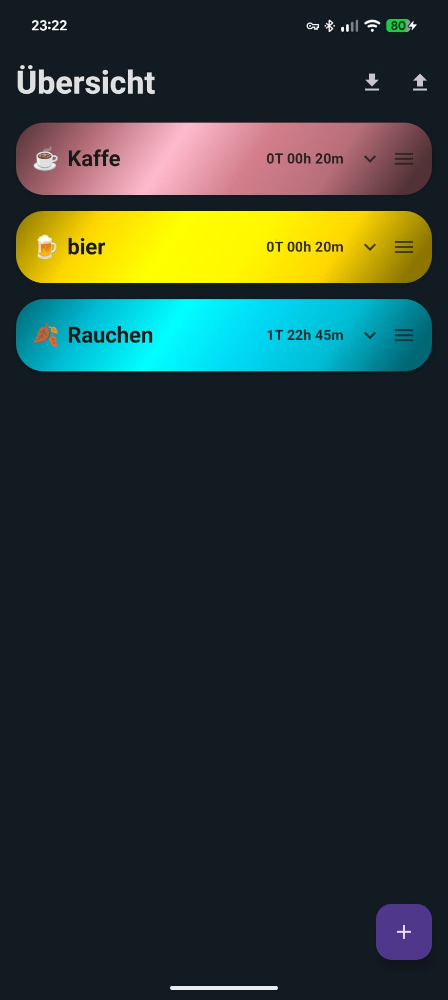
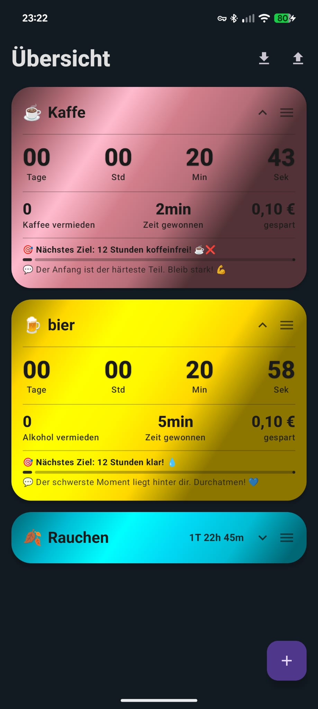
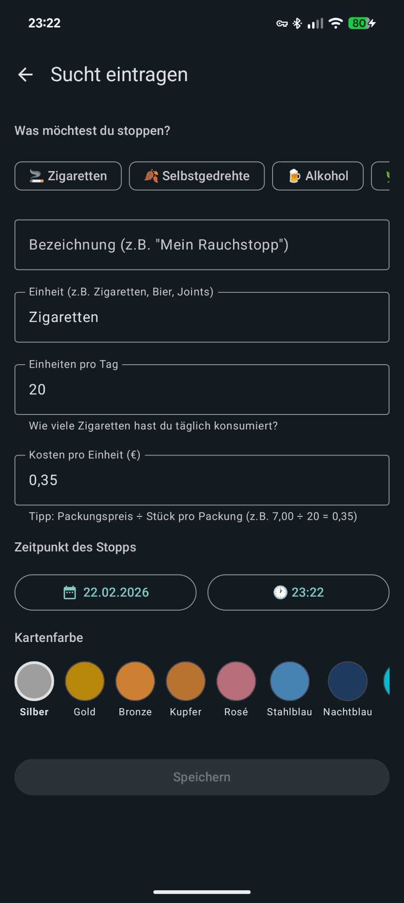

# PureProgress

> Track your freedom. One day at a time.

[](https://kotlinlang.org)
[](https://developer.android.com)
[](https://developer.android.com/jetpack/compose)
[](https://github.com/MartinsMikroKosmos/Nicht_Raucher_App/actions/workflows/android_ci.yml)
[](LICENSE)

PureProgress is a modern Android abstinence tracker for any habit — cigarettes, alcohol, cannabis, coffee, sugar and more. It visualises your progress with metallic cards, substance-specific milestones and push notifications to keep you motivated every step of the way.

---

## Screenshots

<table>
  <tr>
    <td align="center"><br/><sub>Dashboard</sub></td>
    <td align="center"><br/><sub>Expanded Card</sub></td>
    <td align="center"><br/><sub>Add Habit</sub></td>
  </tr>
</table>

---

## Features

- 🃏 **Collapsible Metallic Cards** — Collapsed shows name, substance emoji and compact time; expanded reveals full stats and milestone details
- 🎨 **20 Colour Themes** — Metallic presets (Silver, Gold, Bronze, Cobalt, Emerald, Anthracite and more); text colour is chosen automatically using true WCAG contrast-ratio comparison (white vs. black), adaptive metallic shimmer adjusts highlight intensity per colour brightness
- 🧪 **10 Substance Types** — Cigarettes, Tobacco, Alcohol, Cannabis, Coffee, Sugar, Energy Drinks, Gambling, Social Media, Custom
- 🏆 **Substance-Specific Milestones** — Each type has tailored milestones with medical benefits and motivation quotes
- 🔔 **Push Notifications** — WorkManager fires a notification at every milestone, even when the app is closed
- ⏱️ **Live Timer** — Animated second-by-second counter (Days · Hours · Minutes · Seconds) with text shadow for readability
- 💰 **3-Column Stats** — Units avoided · Time reclaimed · Money saved — all updated in real time
- 📈 **Milestone Progress Bar** — Visual progress towards the next milestone with the last achievement and its medical benefit
- 🔀 **Drag & Drop Reorder** — Long-press the ☰ handle to rearrange cards; order is persisted in Room
- ↔️ **Swipe-to-Delete with Confirmation** — Swipe left, confirm in a dialog — no accidental deletions
- ✏️ **Edit via Long Press** — Tap and hold a card to rename it or change its colour in a bottom sheet
- 💾 **JSON Backup & Restore** — Export all habits to a JSON file in Downloads; re-import on any device
- 🌙 **Dark Mode** — Custom Teal/Indigo Material 3 theme, no dynamic colour

---

## Tech Stack

| Layer | Technology |
| --- | --- |
| Language | Kotlin 2.1 |
| UI | Jetpack Compose + Material 3 |
| Architecture | Clean Architecture + MVVM |
| Dependency Injection | Hilt / Dagger |
| Database | Room v4 (SQLite) with Flow / StateFlow |
| Navigation | Jetpack Navigation Compose |
| Drag & Drop | sh.calvin.reorderable 2.4.0 |
| Notifications | WorkManager + Hilt Worker |
| Min SDK | 26 (Android 8.0) |
| Target SDK | 35 (Android 15) |

---

## Getting Started

### Prerequisites

- **Android Studio** Hedgehog (2023.1.1) or newer
- **JDK 17**

### Installation

```bash
git clone https://github.com/MartinsMikroKosmos/Nicht_Raucher_App.git
```

1. Open the project in Android Studio.
2. Wait for the Gradle sync to complete.
3. Run on an emulator or a device running Android 8.0+:

```bash
./gradlew installDebug
```

---

## Architecture

PureProgress follows **Clean Architecture** with an **MVVM** presentation layer.

```
app/src/main/java/com/example/nicht_raucher_app/
├── ui/                        Presentation (Compose + ViewModels)
│   ├── navigation/            NavGraph
│   ├── dashboard/             DashboardScreen + DashboardViewModel
│   ├── add_habit/             AddHabitScreen + AddHabitViewModel
│   └── theme/                 Color, Theme, Type
├── domain/                    Business Logic
│   ├── Habit.kt               Room Entity
│   ├── SubstanceType.kt       Enum: 10 substance types
│   ├── Repository.kt          Interface
│   └── use_case/              GetHabits, AddHabit, DeleteHabit,
│                              UpdateHabit, UpdateHabitOrder, ImportHabits
├── data/                      Data Layer
│   ├── HabitDao.kt
│   ├── HabitDatabase.kt       v4 + MIGRATION_3_4
│   └── HabitRepositoryImpl.kt
├── milestones/                Milestone System
│   ├── Milestone.kt           medicalBenefit + motivationQuote
│   ├── MilestoneData.kt       Substance-specific lists
│   └── MilestoneScheduler.kt  WorkManager scheduling
├── worker/
│   └── MilestoneWorker.kt     @HiltWorker push notification
├── di/
│   └── AppModule.kt
└── util/
    ├── TimeUtils.kt
    ├── MilestoneUtils.kt      calculateProgress() → MilestoneProgress
    ├── BackupManager.kt       JSON export / import
    └── AppConfig.kt
```

Data flows unidirectionally: **UI → ViewModel → Use Case → Repository → Room DAO → Flow → StateFlow → UI**.

---

## Roadmap

- [ ] Onboarding screen for first-time users
- [ ] Home screen widget
- [ ] Lottie confetti animation on milestone reached
- [ ] "Buy yourself something" suggestion from saved money
- [ ] iCloud / Google Drive cloud backup

---

## Contributing

Pull requests are welcome. For major changes please open an issue first.

1. Fork the repository.
2. Create a feature branch: `git checkout -b feature/my-feature`
3. Commit your changes: `git commit -m 'Add my feature'`
4. Push the branch: `git push origin feature/my-feature`
5. Open a Pull Request.

---

## License

This project is licensed under the [MIT License](LICENSE).